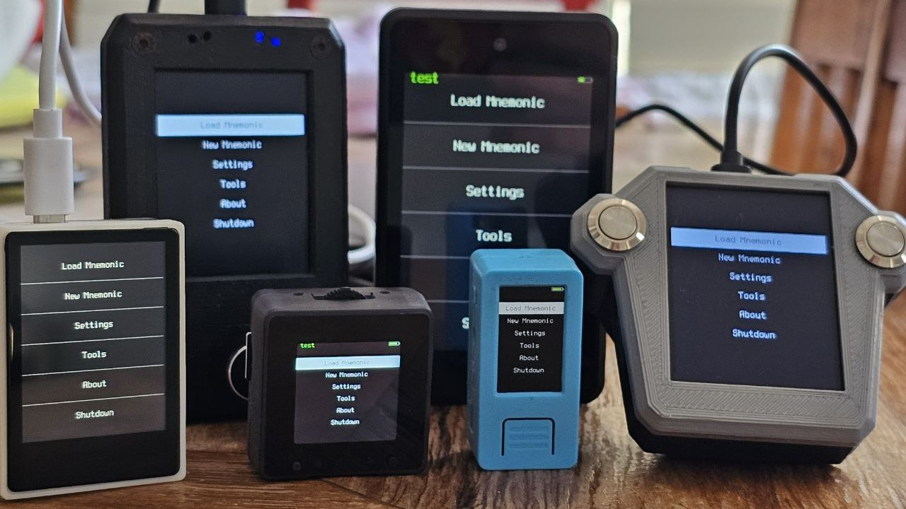

VaultSeed is open-source Bitcoin signing firmware for devices with the K210 chipset; also known as a hardware signer. 

Signing operations in VaultSeed are done offline via QR code or via SD card using the [PSBT](https://bitcoinops.org/en/topics/psbt/) functionality. You can create/load your [BIP39 mnemonic](https://github.com/bitcoin/bips/blob/master/bip-0039.mediawiki), or import a wallet descriptor, and sign transactions all without having to plug the device into your computer (except to initially install the firmware). It reads QR codes with its camera and outputs QR codes to its screen, or to paper via an optional [thermal printer attachment](../getting-started/features/printing/printing.md). 

VaultSeed runs offline, and therefore never handles the broadcasting part of the PSBT transaction. Instead, you can use VaultSeed with third-party wallet coordinators to broadcast transactions from your online computer or mobile device while keeping your keys offline.

These wallet coordinators are currently **compatible with VaultSeed**:

- [Sparrow Wallet](https://www.sparrowwallet.com/) (desktop)
- [Specter Desktop](https://specter.solutions/) (desktop)
- [Liana](https://wizardsardine.com/liana/) (desktop)
- [Bitcoin Safe](https://bitcoin-safe.org/) (desktop)
- [Nunchuk](https://nunchuk.io/) (mobile)
- [BlueWallet](https://bluewallet.io/) (mobile)
- [Bitcoin Keeper](https://bitcoinkeeper.app/) (mobile)
- [BULL Wallet](https://wallet.bullbitcoin.com) (mobile)

**Warning!** VaultSeed is INCOMPATIBLE with:

- [Electrum Bitcoin Wallet](https://electrum.org/) (desktop / mobile - error 'cannot sign') 

